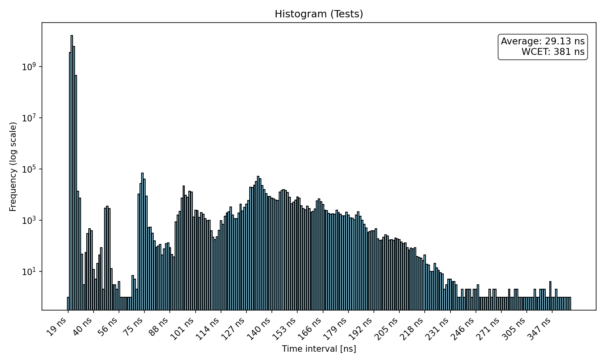

VIM
cp .vimrc to ~/.vimrc
Start with: sudo taskset -c 3 chrt -r 90 make

Ergebnisse: (Ausreißer wild)
mario@rocky:~/test_programs$ sudo taskset -c 2 chrt -r 90 make
python3 visualize.py data.txt Tests && scp data_output.png mario@fedora:/home/mario/Desktop

